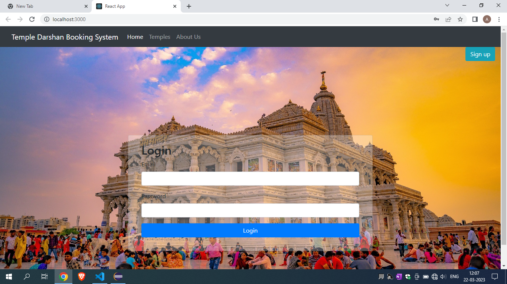
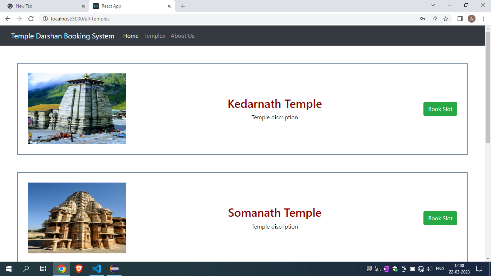
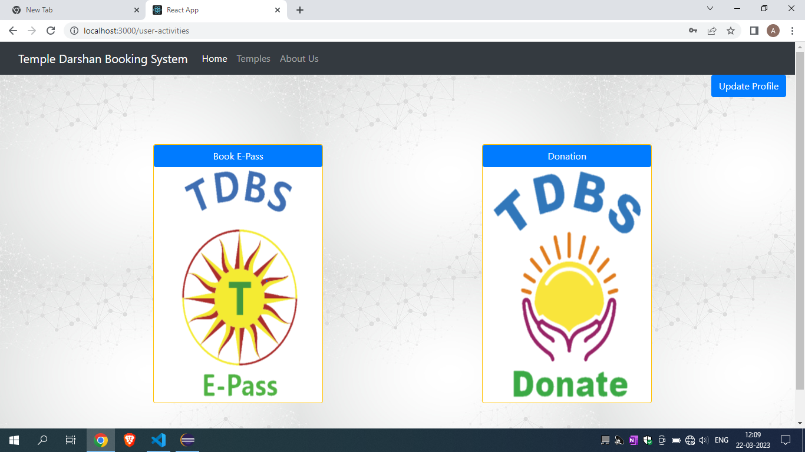
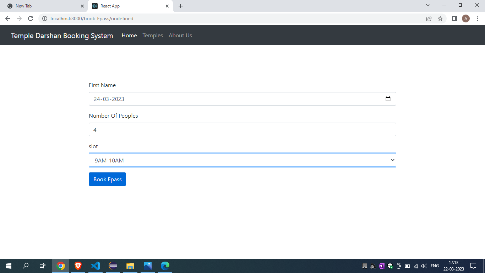
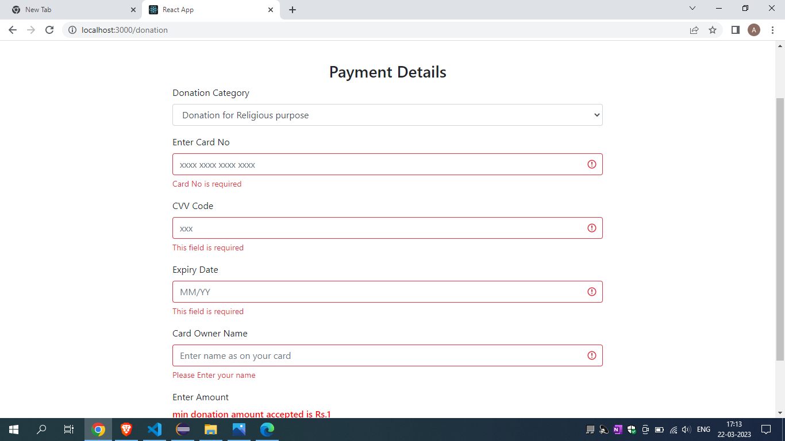
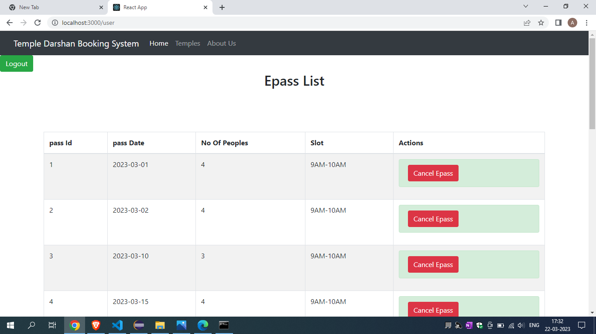

<div align="center">
  
  <h3 align="center">TDBS</h3>
</div>


<!-- TABLE OF CONTENTS -->
<details>
  <summary>Table of Contents</summary>
  <ol>
    <li>
      <a href="#about-the-project">About The Project</a>
    </li>
    <li>
      <a href="#getting-started">Getting Started</a>
      <ul>
        <li><a href="#prerequisites">Prerequisites</a></li>
        <li><a href="#installation">Installation</a></li>
      </ul>
    </li>
    <li><a href="#usage">Usage</a></li>
    <li><a href="#contact">Contact</a></li>
    <li><a href="#acknowledgments">Acknowledgments</a></li>
  </ol>
</details>


<!-- ABOUT THE PROJECT -->
## About The Project

Our prime objective is to reduce waiting time of devotee & provide assistance to temple staff in temple management.
Our project, the Temple Darshan Booking System, is a comprehensive online solution developed using Java web-based technologies, 
it aims to streamline and automate various processes such as queue management for devotees, managing offerings, managing events and poojas.
We have used Spring-Boot, React-JS, MySQL, Java, HTML, Bootstrap, CSS.


<!-- GETTING STARTED -->
## Getting Started


### Prerequisites

Software required to run our project are listed below:

1. JDK 1.8.0_311

2. Node v16.16.0

3. mysql 8.0.29

### Installation

_To deploy Application follow the below instruction_

1. Clone the repository
   ```sh
   git clone https://github.com/amitnikam1/TDBS
   ```
2. Install NPM packages
   ```sh
   npm install
   ```

3. Source sql file into your mysql
   ```sh
   source "location of project.sql file"
   ```
4. Change Credential in application.properties
   ```sh
   Goto -> Backend/src/main/resources/application.properties
   Change username,password,Url for database connectivity in properties
   ```
5. Compile  & run Java Project
6. Run Front end
   ```sh
     npm start
   ```
  


<!-- USAGE EXAMPLES -->
## Usage

Our Project is helpful to streamline and automate various processes such as queue management for devotees, managing offerings, managing events and poojas.


<!-- CONTACT -->
## Contact

Amit Nikam (amitnikam200@gmail.com)

Hitesh Patil (phitesh2022@gmail.com)

Arvind Singh

Abhinav Yadav

Project Link: [https://github.com/amitnikam1/TDBS](https://github.com/your_username/repo_name)


<!-- ACKNOWLEDGMENTS -->
## Acknowledgments

We would like to express our sincere thanks and gratitude to Project Guide for letting us work on this project. we are very grateful to all teachers for their support and guidance in completing this project.


# Let's GO

Home Page : 

Temples List :

User Activities :

Slot Book :

Donation Page:

Admin Page :



---
